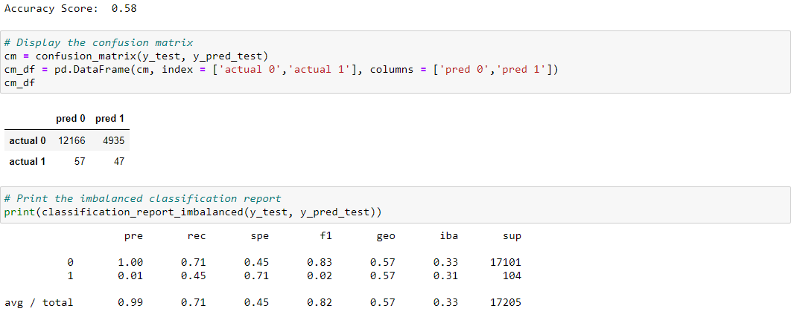
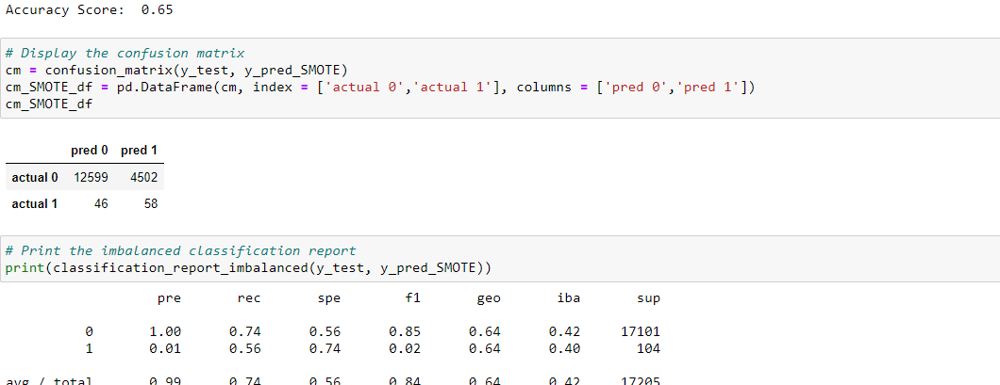
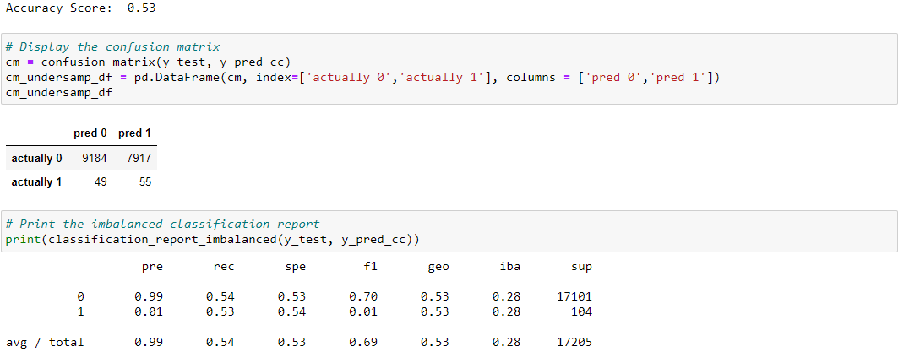
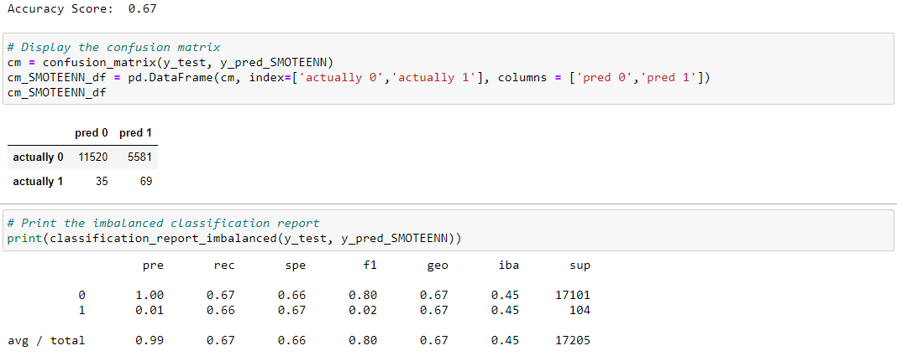
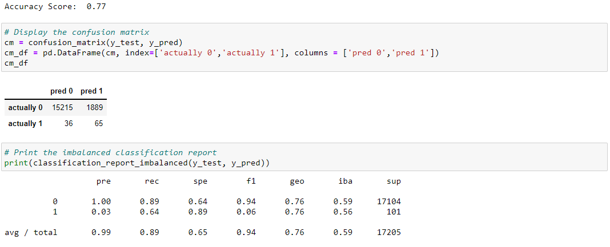
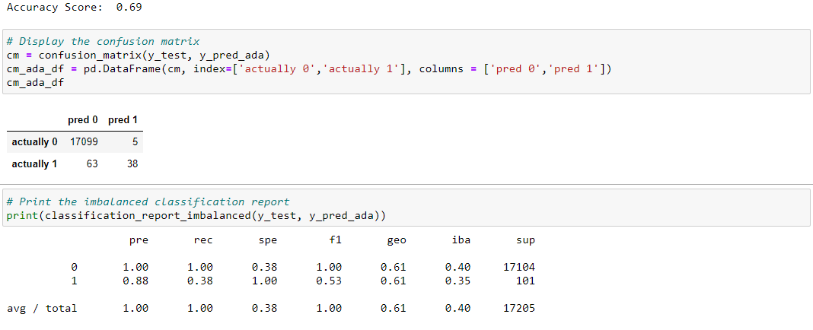

# Credit Risk Analysis

## Contents
- [Overview of the Project](#overview)
- [Files](#files)
- [Results](#results)
- [Summary](#summary)

## Overview
The purpose of this analysis is to predict credit risk using a combination of several machine learning techniques. Given that credit risk is an unbalanced problem, evaluating the problem using multiple models and evaluating the performance of each of the models yields the best solution.

## Files
- credit_risk_resampling.ipynb
- credit_risk_ensemble.ipynb

## Results
Results of the logistic regression after resampling are shown below. In each of these cases, 0 represents low risk and 1 respresents high risk.

1. Random Oversampler

2. SMOTE Oversampler

3. Cluster Centroids Undersampler

4. SMOTEENN Combination Resampler

5. Balanced Classifier

6. ADA Boost Classifier

## Summary

Multiple techniques were used to predict credit risk. Overall, none of the models perform adequately for direct use. 

The balanced classifier has the highest accuracy score, but cannot be recommended as there are numerous false positives. This would result in a hgh degree of lost opportuity for the company.
